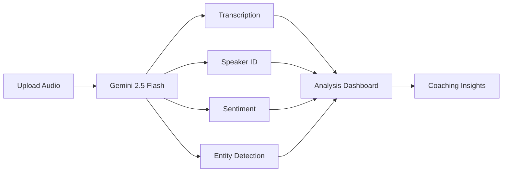

# 📞 SalesIQ

<div align="center">

**An AI-Powered Sales Coaching Platform**

[](https://www.typescriptlang.org/)
[](https://reactjs.org/)
[](https://vitejs.dev/)
[](https://ai.google.dev/)

*Analyze sales calls with AI • Get instant coaching • Improve conversion rates*

[Features](#-features) • [Demo](#-how-it-works) • [Quick Start](#-quick-start) • [Documentation](#-api-documentation)

</div>

---

## 🎯 Overview

SalesIQ transforms raw sales call recordings into actionable intelligence. Powered by **Google's Gemini 2.5 Flash**, our platform automatically analyzes conversations to help sales teams understand what works, what doesn't, and how to close more deals.

### What You Get

```
📝 Transcription     →  Speaker-diarized, timestamped transcripts
😊 Sentiment         →  Real-time customer emotion tracking
🎯 Coaching          →  AI-generated feedback and tips
🏆 Strengths         →  What you're doing right
⚠️  Opportunities    →  What you're missing
🏢 Competitors       →  Automatic mention detection
```

---

## ✨ Features

### 🎙️ **Intelligent Transcription**
- **Speaker Diarization**: Automatically identifies who said what
- **Timestamped Segments**: Jump to any part of the conversation
- **Section Detection**: Auto-categorizes into Introduction, Discovery, Pitch, Objections, and Closure
- **High Accuracy**: Powered by Gemini 2.5 Flash for precise transcription

### 📊 **Sentiment Analysis**
- **Visual Timeline**: See customer sentiment changes throughout the call
- **Emotional Markers**: Identify positive, neutral, and negative moments
- **Sentiment Scoring**: Quantify overall call tone and engagement
- **Critical Moments**: Pinpoint where conversations went well or off track

### 🎓 **AI Coaching Engine**
- **Strengths Analysis**: Discover what you're doing right
- **Improvement Areas**: Get specific suggestions for growth
- **Missed Opportunities**: See questions or topics you should have explored
- **Best Practices**: Receive tailored coaching based on your conversation style
- **Recommended Responses**: Learn better ways to handle objections

### 🔍 **Competitive Intelligence**
- **Competitor Detection**: Automatically flag when competitors are mentioned
- **Context Capture**: See exactly how and why competitors came up
- **Product References**: Track mentions of products, features, and categories
- **Topic Clustering**: Group related discussion points automatically

### 📈 **Performance Insights** *(Coming Soon)*
- Rep performance dashboards
- Call quality scoring
- Trend analysis over time
- Exportable reports

---

## 🛠️ Tech Stack

| Layer | Technology |
|-------|-----------|
| **Frontend** | React 18 + TypeScript + Vite |
| **AI Engine** | Google Gemini 2.5 Flash |
| **Styling** | Modern CSS + Component Libraries |
| **Build Tool** | Vite (Fast HMR & Optimized Builds) |
| **Package Manager** | npm |

### Why Gemini 2.5 Flash?

- **Multimodal**: Handles audio directly without pre-processing
- **Fast**: Real-time processing for quick insights
- **Accurate**: State-of-the-art transcription and understanding
- **Cost-Effective**: Optimized pricing for production workloads

---

## 📁 Project Structure

```
salesiq/
├── src/
│   ├── components/          # Reusable UI components
│   │   ├── CallUpload.tsx   # File upload interface
│   │   ├── Transcript.tsx   # Transcript viewer
│   │   ├── Sentiment.tsx    # Sentiment visualization
│   │   └── Coaching.tsx     # Coaching feedback panel
│   ├── services/            # Business logic & API
│   │   ├── gemini.ts        # Gemini API integration
│   │   ├── audio.ts         # Audio processing utilities
│   │   └── api.ts           # Backend communication
│   ├── types/               # TypeScript type definitions
│   │   └── analysis.ts      # Analysis result types
│   ├── utils/               # Helper functions
│   ├── App.tsx              # Main application component
│   └── main.tsx             # Application entry point
├── public/                  # Static assets
├── .env.example             # Environment variables template
├── vite.config.ts           # Vite configuration
├── tsconfig.json            # TypeScript configuration
└── package.json             # Dependencies
```

---

## 🚀 Quick Start

### Prerequisites

Before you begin, ensure you have:

- **Node.js** 16.x or higher
- **npm** or **yarn**
- **Google Gemini API Key** ([Get one here](https://ai.google.dev/))

### Installation

```bash
# Clone the repository
git clone https://github.com/MohammadAli-dev/salesiq.git

# Navigate to project directory
cd salesiq

# Install dependencies
npm install

# Create environment file
cp .env.example .env
```

### Configuration

Edit `.env` and add your credentials:

```env
VITE_GEMINI_API_KEY=your_gemini_api_key_here
VITE_API_ENDPOINT=https://your-backend.example.com  # Optional
```

### Development

```bash
# Start development server
npm run dev

# Open browser to http://localhost:5173
```

### Production Build

```bash
# Build for production
npm run build

# Preview production build
npm run preview
```

---

## 🧩 How It Works



### Step-by-Step Flow

1. **📤 Upload**: User uploads a sales call recording (MP3, WAV, M4A)
2. **🤖 Processing**: Audio is sent to Gemini 2.5 Flash API
3. **🔄 Analysis**: AI generates:
   - Full transcript with speaker labels
   - Sentiment scores for each segment
   - Competitor and entity mentions
   - Coaching recommendations
4. **📊 Visualization**: Results displayed in interactive dashboard:
   - Scrollable transcript with timestamps
   - Sentiment timeline chart
   - Coaching feedback cards
   - Competitor mentions highlighted

---

## 🎨 Usage

### Uploading a Call

1. Click **"Upload Call Recording"** button
2. Select audio file (supported: `.mp3`, `.wav`, `.m4a`)
3. Wait for processing (typically 30-60 seconds)

### Viewing Insights

**Transcript Tab**
- Read full conversation with speaker labels
- Click timestamps to jump to specific moments
- Search for keywords or phrases

**Sentiment Tab**
- View emotional timeline graph
- Identify positive and negative moments
- See sentiment score breakdown

**Coaching Tab**
- Review identified strengths
- Read improvement suggestions
- See missed opportunities
- Get recommended responses for objections

**Intelligence Tab**
- View competitor mentions with context
- See product and feature references
- Review topic clustering

---

## 🔑 Environment Variables

| Variable | Description | Required | Default |
|----------|-------------|----------|---------|
| `VITE_GEMINI_API_KEY` | Your Google Gemini API key | ✅ Yes | - |
| `VITE_API_ENDPOINT` | Backend API URL (if using) | ❌ No | - |
| `VITE_MAX_FILE_SIZE` | Max upload size in MB | ❌ No | `50` |

### Getting Your Gemini API Key

1. Visit [Google AI Studio](https://ai.google.dev/)
2. Sign in with your Google account
3. Navigate to **API Keys** section
4. Create a new API key
5. Copy and paste into your `.env` file

---

## 📚 API Documentation

### Core Services

#### `services/gemini.ts`

```typescript
// Analyze audio file
async function analyzeCall(audioFile: File): Promise<AnalysisResult>

// Get transcript only
async function transcribeAudio(audioFile: File): Promise<Transcript>

// Get sentiment analysis
async function analyzeSentiment(transcript: Transcript): Promise<Sentiment[]>
```

#### `types/analysis.ts`

```typescript
interface AnalysisResult {
  transcript: TranscriptSegment[];
  sentimentGraph: SentimentPoint[];
  coaching: CoachingFeedback;
  competitors: CompetitorMention[];
  callScore: number;
  objections: Objection[];
}
```

For complete API documentation, see [API.md](./docs/API.md)

---

## 🧪 Testing

```bash
# Run unit tests
npm test

# Run tests with coverage
npm run test:coverage

# Run E2E tests
npm run test:e2e
```

---

## 🤝 Contributing

We welcome contributions! Here's how to get started:

### Development Workflow

1. **Fork** the repository
2. **Create** a feature branch
   ```bash
   git checkout -b feature/amazing-feature
   ```
3. **Commit** your changes
   ```bash
   git commit -m 'Add amazing feature'
   ```
4. **Push** to your branch
   ```bash
   git push origin feature/amazing-feature
   ```
5. **Open** a Pull Request

### Contribution Guidelines

- Follow TypeScript best practices
- Write tests for new features
- Update documentation
- Keep commits atomic and well-described
- Ensure all tests pass before submitting PR

---

## 🗺️ Roadmap

### ✅ Phase 1 (Current)
- [x] Audio upload and processing
- [x] Gemini 2.5 Flash integration
- [x] Transcript generation
- [x] Sentiment analysis
- [x] Basic coaching insights

### 🚧 Phase 2 (In Progress)
- [ ] Real-time call analysis
- [ ] Multi-language support
- [ ] Advanced coaching algorithms
- [ ] Team dashboard

### 📋 Phase 3 (Planned)
- [ ] CRM integrations (Salesforce, HubSpot)
- [ ] Mobile app (React Native)
- [ ] Custom coaching templates
- [ ] Performance benchmarking

---

## 📄 License

This project is licensed under the **MIT License** - see the [LICENSE](LICENSE) file for details.

---

## 👨‍💻 Author

**Mohammad Ali**

- 🐙 GitHub: [@MohammadAli-dev](https://github.com/MohammadAli-dev)
- 📧 Email: [mohammad8.ali6@gmail.com](mailto:mohammad8.ali6@gmail.com)
- 💼 LinkedIn: [Connect with me](https://linkedin.com/in/mohammadali-dev)

---

## 🙏 Acknowledgements

- **Google Gemini Team** - For the powerful Gemini 2.5 Flash model
- **React Community** - For excellent libraries and tools
- **TypeScript Team** - For making JavaScript development better
- **Beta Testers** - Sales teams providing valuable feedback
- **Open Source Contributors** - Everyone who has contributed to this project

---

## 💡 Support

### Having Issues?

- 📖 Check the [Documentation](./docs/)
- 🐛 [Report a Bug](https://github.com/MohammadAli-dev/salesiq/issues)
- 💬 [Ask a Question](https://github.com/MohammadAli-dev/salesiq/discussions)
- ⭐ Star the repo if you find it useful!

---

<div align="center">

**Made with ❤️ for Sales Teams Worldwide**

[⬆ Back to Top](#-salesiq)

</div>
